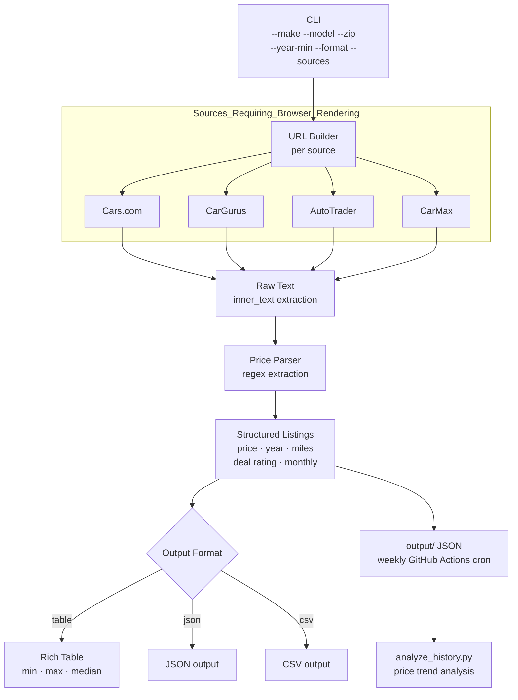

# carrecon


**Live car prices from sites that block everyone else.**

An open-source tool that fetches **used car prices from Cars.com and CarGurus** and **official specs from the EPA** — rendering full browser sessions with Playwright to handle sites that block simple HTTP requests.

Works for **any make, model, year range, and ZIP code.**

---

## Why I Built This

I was researching a family car purchase and spent hours manually clicking through bot checks on Cars.com, CarGurus, and Edmunds — copying prices into a spreadsheet, refreshing pages, losing data. I asked AI assistants for help. Every one of them hit the same wall: **every major car site blocks simple automated requests.**

So I built a browser-based aggregator. This tool runs a real Chromium browser session via Playwright, aggregates live prices across all four major used car sites and six manufacturer websites, extracts structured data, and lets you search any car with a single command.

**Built and tested using Claude Code as the development environment.** What used to take hours of manual browsing now takes one command.

40M+ used cars are sold annually in the US. Every buyer wastes hours on this exact problem.

---

## Weekly Price History

A GitHub Actions cron runs every Monday and commits fresh price snapshots to `output/`. Browse the price history to track depreciation over time.

---

## The Problem

Every major car listing site blocks automated access:
- Cars.com, CarGurus, AutoTrader → Cloudflare / bot detection
- Toyota.com, Lexus.com → 403 on simple HTTP requests
- KBB, Edmunds → rate limiting + auth walls

This tool runs a **real browser session via Playwright** — rendering pages the same way a standard browser would — then extracts and structures the pricing data.

---

## What It Does

| Feature | How |
|---------|-----|
| **Used car prices** | Playwright (browser automation) → Cars.com, CarGurus, AutoTrader, CarMax |
| **New car MSRP** | Playwright (browser automation) → Toyota, Lexus, Honda, Hyundai, Ford, Chevrolet |
| **Official MPG data** | EPA fueleconomy.gov free API (no auth required) |
| **Structured output** | Price, year, mileage, deal rating, monthly payment |
| **Multiple output formats** | Table (default), JSON, CSV |
| **Source selection** | `--sources cars cargurus autotrader carmax` |
| **Price trend analysis** | `scripts/analyze_history.py` — track depreciation over time |
| **Weekly price tracking** | GitHub Actions cron — auto-commits snapshots every Monday |

> All sites listed block standard HTTP requests. This tool uses Playwright to run a full browser session, so pages render the same way they would for any visitor.

---

## System Design



## Setup

```bash
git clone https://github.com/TushGoel/carrecon.git
cd carrecon

python3 -m venv .venv
source .venv/bin/activate
pip install -r requirements.txt
playwright install chromium
```

---

## Usage

### Search used car prices

```bash
# Basic search
python3 main.py --make toyota --model sienna --zip 75080

# With year range and price cap
python3 main.py --make honda --model odyssey --zip 10001 --year-min 2022 --max-price 45000

# Save results to JSON
python3 main.py --make lexus --model tx --zip 98101 --year-min 2024 --save

# Multi-word model name
python3 main.py --make toyota --model "grand highlander" --zip 90210 --year-min 2024
```

### Options

```
--make         Car make (toyota, honda, lexus, ford, ...)
--model        Car model (sienna, odyssey, tx, ...)
--zip          ZIP code for search radius
--year-min     Minimum model year
--year-max     Maximum model year
--max-price    Maximum price filter
--max-miles    Maximum mileage (default: 80,000)
--save         Save results to output/ as JSON
```

### Get official new car MSRP from manufacturer websites

Toyota, Lexus, Honda, Hyundai, Ford, Chevrolet all block standard HTTP requests.
This tool uses the same Playwright browser automation to fetch official pricing and trim data:

```bash
# List available models for a manufacturer
python3 scripts/new_car_prices.py --list-models toyota

# Fetch MSRP for a specific model
python3 scripts/new_car_prices.py --make toyota --model sienna
python3 scripts/new_car_prices.py --make lexus --model tx
python3 scripts/new_car_prices.py --make honda --model odyssey --save
```

### Get official EPA MPG data

```bash
python3 scripts/epa_specs_fetcher.py
```

---

## Example Output

```
══════════════════════════════════════════════════════════
🔍 TOYOTA SIENNA (2022–2024) near 75080
══════════════════════════════════════════════════════════

┌─────────────┬──────┬────────┬────────────┬─────────┬──────────┐
│       Price │ Year │  Miles │ Deal       │ Monthly │ Source   │
├─────────────┼──────┼────────┼────────────┼─────────┼──────────┤
│     $39,500 │ 2022 │ 41,200 │ Good Deal  │ $729/mo │ Cars.com │
│     $41,888 │ 2023 │ 28,500 │ Fair Deal  │ $772/mo │ CarGurus │
│     $43,758 │ 2024 │ 12,100 │ Good Deal  │ $808/mo │ Cars.com │
└─────────────┴──────┴────────┴────────────┴─────────┴──────────┘

  Range:    $39,500 – $47,200
  Median:   $43,758
  Listings: 8
```

---

## Project Structure

```
carrecon/
├── main.py
├── requirements.txt
├── scrapers/
│   ├── base.py  autotrader.py  cargurus.py  carmax.py
├── scripts/
│   ├── new_car_prices.py      # MSRP from manufacturer sites
│   ├── analyze_history.py     # Price trend analysis
│   ├── generate_report.py     # HTML comparison report
│   └── epa_specs_fetcher.py
├── tests/
│   ├── test_price_parser.py
│   ├── test_url_builders.py
│   └── test_scraper_mock.py
└── data/
```

---

## Design Decisions & Trade-offs

**Why Playwright over requests/BeautifulSoup:**
Every major car site uses Cloudflare or custom bot detection. Simple HTTP requests return 403/blocked responses. Playwright runs a real Chromium browser — identical to a human visitor. Stealth mode patches the `navigator.webdriver` flag and other bot-detection signals.

**Why regex over DOM selector parsing:**
Car listing sites change their HTML structure frequently — a CSS selector that works today breaks after their next deploy. Regex on `innerText` is more resilient: it targets the content (prices, years, mileage) regardless of the DOM structure around it.

**Why multi-source by default:**
Each site has different inventory, different deal ratings, and different data freshness. Aggregating across Cars.com, CarGurus, AutoTrader, and CarMax gives a more accurate market picture than any single source. Use `--sources` to restrict when you only want one.

**Why structured output instead of raw text:**
Raw text from `inner_text()` is noisy — it includes navigation, ads, footer text. The price parser extracts only the signal (price, year, miles, deal rating) using regex patterns that are tuned for car listing formats. This makes the output programmatically useful, not just readable.

**Why GitHub Actions cron for price tracking:**
Car prices fluctuate weekly based on supply, season, and inventory. A manual snapshot is a point-in-time view. The weekly cron turns this into a time-series dataset — you can track depreciation, spot seasonal patterns, and identify when prices are moving.

## Roadmap

- [x] Add CarMax scraper ✅
- [x] Add AutoTrader scraper ✅
- [x] Weekly price tracking via GitHub Actions cron ✅
- [x] HTML comparison report generator ✅
- [x] Parallel scraping across sources ✅
- [ ] KBB fair market value integration

---

## Disclaimer

For personal research only. Respect each site's terms of service.

## License

MIT
